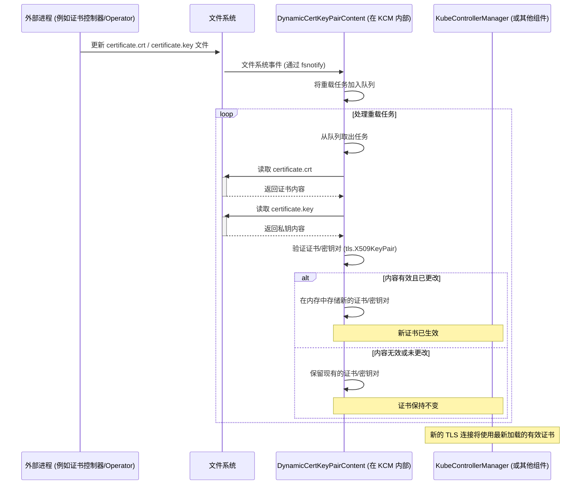

# Kubernetes/OpenShift Serving Certificate 轮换逻辑分析

## 核心机制

Kubernetes/OpenShift 组件（如 `kube-controller-manager`）的 Serving Certificate（用于保护其 HTTPS 端点，例如 metrics 接口）的轮换机制，并非基于组件代码内部定义的固定时间间隔。它依赖于**动态监控**组件配置中指定的证书（`.crt`）和私钥（`.key`）文件。当这些文件在文件系统上被更新时，组件会自动重新加载新的证书/密钥对，无需重启。

## 代码逻辑追踪

1.  **配置加载 (`vendor/k8s.io/apiserver/pkg/server/options/serving.go`)**:
    *   组件通过启动参数（如 `--tls-cert-file` 和 `--tls-private-key-file`）或相应的配置文件字段，指定 Serving Certificate 及其私钥的文件路径。
    *   组件启动时，`SecureServingOptions` 结构体中的 `ApplyTo` 方法会检查这些文件路径是否被提供。
    *   如果提供了文件路径，该方法会调用 `dynamiccertificates.NewDynamicServingContentFromFiles` 来初始化一个动态证书内容提供者。

    ```go
    // 源代码: vendor/k8s.io/apiserver/pkg/server/options/serving.go
    // 位于 ApplyTo 方法内部:
    if len(serverCertFile) != 0 || len(serverKeyFile) != 0 {
        var err error
        // 此处创建了监控磁盘文件的提供者
        c.Cert, err = dynamiccertificates.NewDynamicServingContentFromFiles("serving-cert", serverCertFile, serverKeyFile)
        if err != nil {
            return err
        }
    }
    ```

    ```go
    // 源代码: pkg/operator/targetconfigcontroller/targetconfigcontroller.go
            kcmContainerArgsWithLoglevel[0] += " --tls-cert-file=/etc/kubernetes/static-pod-resources/secrets/serving-cert/tls.crt"
		kcmContainerArgsWithLoglevel[0] += " --tls-private-key-file=/etc/kubernetes/static-pod-resources/secrets/serving-cert/tls.key"
    ```

2.  **动态监控与重载 (`vendor/k8s.io/apiserver/pkg/server/dynamiccertificates/dynamic_serving_content.go`)**:
    *   上一步创建的 `DynamicCertKeyPairContent` 对象负责执行监控任务。
    *   它利用 `fsnotify` 库来监听指定证书和密钥文件的文件系统事件（例如写入、重命名、删除等）。

    ```go
    // 源代码: vendor/k8s.io/apiserver/pkg/server/dynamiccertificates/dynamic_serving_content.go
    // 位于 watchCertKeyFile 方法内部:
    w, err := fsnotify.NewWatcher()
    // ...
    if err := w.Add(c.certFile); err != nil { // 添加对证书文件的监听
        // ...
    }
    if err := w.Add(c.keyFile); err != nil { // 添加对私钥文件的监听
        // ...
    }
    ```

    *   当 `fsnotify` 检测到文件发生变化时，它会将一个重新加载证书对的任务放入工作队列 (`handleWatchEvent` -> `queue.Add`)。
    *   一个后台工作线程 (`runWorker` -> `processNextWorkItem`) 会处理队列中的任务，并调用 `loadCertKeyPair` 方法。
    *   `loadCertKeyPair` 方法会从磁盘读取证书和密钥文件的内容。然后，它使用 `tls.X509KeyPair` 来验证这两个文件是否构成一个有效的密钥对。

    ```go
    // 源代码: vendor/k8s.io/apiserver/pkg/server/dynamiccertificates/dynamic_serving_content.go
    // 位于 loadCertKeyPair 方法内部:
    cert, err := os.ReadFile(c.certFile)
    // ... 读取私钥文件 ...
    // 确保证书和私钥匹配且都有效
    _, err = tls.X509KeyPair(cert, key) // 验证步骤
    if err != nil {
        return err // 如果无效，则不加载
    }
    ```

    *   如果密钥对有效，并且其内容与当前加载的内容不同，则新的证书和密钥将被加载到内存中 (`c.certKeyPair.Store`)。之后该组件处理的所有新的 TLS 连接都将使用这个新加载的证书。

## 总结

Serving Certificate 的“轮换周期”并非由组件代码本身决定。它取决于负责生成新证书/密钥并将其写入到组件所配置的文件路径的**外部系统**（例如，证书管理控制器、Operator 的逻辑或手动操作）。组件只是**被动地响应**这些文件更新事件。

## 时序图



## 相关源代码

支持此分析的关键源代码片段位于：

*   `vendor/k8s.io/apiserver/pkg/server/options/serving.go` (特别是 `ApplyTo` 方法)
*   `vendor/k8s.io/apiserver/pkg/server/dynamiccertificates/dynamic_serving_content.go` (例如 `watchCertKeyFile`, `loadCertKeyPair` 等方法)
