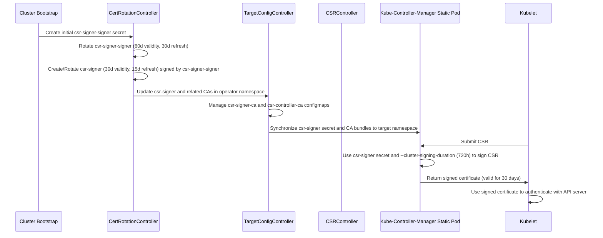

# Kubelet CSR Secret 管理分析

本文分析了在本项目中，与 Kubelet 证书签名请求 (CSR) 相关的 Secret 如何被管理、创建、更新，以及它们的使用场景和过期时间。

## 1. Secret 名称和位置

- `csr-signer-signer`: 这是 `csr-signer` Secret 的签名 CA。位于 `openshift-kube-controller-manager-operator` 命名空间。
- `csr-signer`: 这个 Secret 包含用于签名 Kubelet CSR 的签名密钥和证书。它在 `openshift-kube-controller-manager-operator` 命名空间中进行管理，并同步到 `openshift-kube-controller-manager` 命名空间供静态 Pod 使用。
- `csr-signer-ca`: 位于 `openshift-kube-controller-manager-operator` 命名空间中的 ConfigMap，包含 `csr-signer` 的 CA 捆绑包。
- `csr-controller-signer-ca`: 位于 `openshift-kube-controller-manager-operator` 命名空间中的 ConfigMap，包含 `csr-signer-signer` 的 CA 捆绑包。
- `csr-controller-ca`: 位于 `openshift-kube-controller-manager-operator` 命名空间中的 ConfigMap，结合了 `csr-signer-ca` 和 `csr-controller-signer-ca` 的 CA 捆绑包。

## 2. 创建

初始的 `csr-signer-signer` Secret 在集群引导过程中从预生成的资产 (`kubelet-signer.crt` 和 `kubelet-signer.key`) 创建。这可以从引导清单文件中看出：

```yaml
# bindata/bootkube/manifests/secret-csr-signer-signer.yaml
apiVersion: v1
kind: Secret
metadata:
  name: csr-signer-signer
  namespace: openshift-kube-controller-manager-operator
  annotations:
    "auth.openshift.io/certificate-not-before": {{ .Assets | load "kubelet-signer.crt" | notBefore }}
    "auth.openshift.io/certificate-not-after": {{ .Assets | load "kubelet-signer.crt" | notAfter }}
    "auth.openshift.io/certificate-issuer": {{ .Assets | load "kubelet-signer.crt" | issuer }}
type: kubernetes.io/tls
data:
  tls.crt: {{ .Assets | load "kubelet-signer.crt" | base64 }}
  tls.key: {{ .Assets | load "kubelet-signer.key" | base64 }}
```

然后，`CertRotationController` 接管此 Secret 和 `csr-signer` Secret 的管理和轮换。

## 3. 更新和轮换

`CertRotationController` (`pkg/operator/certrotationcontroller/certrotationcontroller.go`) 负责根据其有效期和刷新周期轮换 `csr-signer-signer` 和 `csr-signer` Secret：

```go
// pkg/operator/certrotationcontroller/certrotationcontroller.go
func newCertRotationController(
	// ...
) (*CertRotationController, error) {
	// ...
	certRotator := certrotation.NewCertRotationController(
		"CSRSigningCert",
		certrotation.RotatedSigningCASecret{
			Namespace: operatorclient.OperatorNamespace,
			Name: "csr-signer-signer", // signer of the signer
			// ...
			Validity:               60 * rotationDay, // 60 days
			Refresh:                30 * rotationDay, // 30 days
			// ...
		},
		// ...
		certrotation.RotatedSelfSignedCertKeySecret{
			Namespace: operatorclient.OperatorNamespace,
			Name:      "csr-signer",
			// ...
			Validity:               30 * rotationDay, // 30 days
			Refresh:                15 * rotationDay, // 15 days
			// ...
			CertCreator: &certrotation.SignerRotation{
				SignerName: "kube-csr-signer",
			},
			// ...
		},
		// ...
	)
	// ...
}
```

`TargetConfigController` (`pkg/operator/targetconfigcontroller/targetconfigcontroller.go`) 和 `CSRController` (`pkg/cmd/recoverycontroller/csrcontroller.go`) 将这些 Secret 和相关的 ConfigMap 同步到目标命名空间：

```go
// pkg/operator/targetconfigcontroller/targetconfigcontroller.go
func createTargetConfigController(ctx context.Context, syncCtx factory.SyncContext, c TargetConfigController, operatorSpec *operatorv1.StaticPodOperatorSpec, useSecureServiceCA bool) (bool, error) {
	// ...
	_, _, err := ManageCSRIntermediateCABundle(ctx, c.secretLister, c.kubeClient.CoreV1(), syncCtx.Recorder())
	// ...
	_, _, err = ManageCSRCABundle(ctx, c.configMapLister, c.kubeClient.CoreV1(), syncCtx.Recorder())
	// ...
	_, requeueDelay, _, err := ManageCSRSigner(ctx, c.secretLister, c.kubeClient.CoreV1(), syncCtx.Recorder())
	// ...
}

// pkg/cmd/recoverycontroller/csrcontroller.go
func (c *CSRController) sync(ctx context.Context) error {
	// ...
	_, changed, err := targetconfigcontroller.ManageCSRIntermediateCABundle(ctx, c.secretLister, c.kubeClient.CoreV1(), c.eventRecorder)
	// ...
	_, changed, err = targetconfigcontroller.ManageCSRCABundle(ctx, c.configMapLister, c.kubeClient.CoreV1(), c.eventRecorder)
	// ...
	_, requeueDelay, changed, err := targetconfigcontroller.ManageCSRSigner(ctx, c.secretLister, c.kubeClient.CoreV1(), c.eventRecorder)
	// ...
}
```

`targetconfigcontroller.go` 中的 `ManageCSRSigner` 函数包含一个延迟，以允许新的签名证书传播：

```go
// pkg/operator/targetconfigcontroller/targetconfigcontroller.go
func ManageCSRSigner(ctx context.Context, lister corev1listers.SecretLister, client corev1client.SecretsGetter, recorder events.Recorder) (*corev1.Secret, time.Duration, bool, error) {
	// ...
	// make sure we wait five minutes to propagate the change to other components, like kas for trust
	useAfter := useAfter.Add(5 * time.Minute)
	now := time.Now()
	// ...
	switch {
	// ...
	default:
		// wait a little while longer until after the useAfter
		return nil, useAfter.Sub(now) + 10*time.Second, false, nil
	}
	// ...
}
```

## 4. Kubelet 客户端证书 (由 Kubelet 自身管理)

*   **管理方式:** 由 Kubelet 自身的内部 `certificate.Manager` 管理 (`kubernetes/pkg/kubelet/certificate/kubelet.go`)。
*   **创建方式:**
    *   **初始创建:** 集群安装/引导期间，一个短生命周期（可能为 1 天）的引导客户端证书和密钥被提供给 Kubelet。相关的代码片段如下：
        ```go
        // ../kubernetes/pkg/kubelet/certificate/kubelet.go
        func NewKubeletClientCertificateManager(
        	// ...
        	bootstrapCertData []byte, // 初始引导证书数据
        	bootstrapKeyData []byte,   // 初始引导密钥数据
        	clientsetFn certificate.ClientsetFunc,
        	// ...
        ) (certificate.Manager, error) {
        	// ...
        	m, err := certificate.NewManager(&certificate.Config{
        		// ...
        		BootstrapCertificatePEM: bootstrapCertData,
        		BootstrapKeyPEM:         bootstrapKeyData,
        		// ...
        	})
        	// ...
        }
        ```
    *   **后续创建:** Kubelet 使用引导证书向 API Server 提交 CSR。`kube-controller-manager`（使用 `csr-signer`）签署此 CSR，签发一个 30 天有效期的证书。Kubelet 获取并使用新证书，并在其过期前通过 CSR 流程进行轮换。
*   **使用场景:** Kubelet 用于向 Kubernetes API Server 进行身份验证。
*   **过期时间:** 初始引导证书有效期较短（例如 1 天）。通过 CSR 获取的后续证书有效期为 30 天，由 Kubelet 的证书管理器负责监控和轮换。

## 5. 使用场景

目标命名空间中的 `csr-signer` Secret 由 kube-controller-manager 用于自动批准和签名 Kubelet CSR。这是 Kubelet 加入集群并获取客户端证书以与 API 服务器通信的关键步骤。CA 捆绑包 (`csr-signer-ca`、`csr-controller-signer-ca`、`csr-controller-ca`) 用于各种组件的信任验证。

## 6. 与 Kubelet CSR 批准的关系和证书过期时间

与 Kubelet CSR 的关系主要体现在 `csr-signer` Secret 被 kube-controller-manager 静态 Pod 用于签名 Kubelet 提交的证书签名请求 (CSR)。kube-controller-manager 中的 CSR 签名控制器负责自动批准符合条件的 Kubelet CSR，并使用 `csr-signer` Secret 中的私钥对请求的证书进行签名。

`TargetConfigController` (`pkg/operator/targetconfigcontroller/targetconfigcontroller.go`) 负责将 `csr-signer` Secret 同步到 kube-controller-manager 静态 Pod 所在的命名空间，确保签名密钥和证书对签名过程可用。

被批准和签名的 Kubelet 客户端证书的过期时间由传递给 kube-controller-manager 的 `--cluster-signing-duration` 参数控制。根据项目中的测试文件 (`pkg/operator/targetconfigcontroller/targetconfigcontroller_test.go` 和 `pkg/cmd/render/render_test.go`)，这个参数通常设置为 `720h`，这意味着签名的证书有效期为 720 小时（30 天）。

例如，在 `pkg/cmd/render/render_test.go` 中可以看到以下参数：

```go
// pkg/cmd/render/render_test.go
						"--cluster-signing-cert-file=/etc/kubernetes/secrets/kubelet-signer.crt",
						"--cluster-signing-duration=720h",
						"--cluster-signing-key-file=/etc/kubernetes/secrets/kubelet-signer.key",
```

这意味着由 kube-controller-manager 签名的 Kubelet 客户端证书的有效期为 30 天。

用户观察到的初始证书 1 天过期，很可能是 Kubelet 在引导阶段使用的**初始引导客户端证书**的特性，而非 `csr-signer` 签发证书的默认有效期。这个初始证书由外部工具生成，用于 Kubelet 初次连接 API Server 并提交 CSR，然后 Kubelet 会立即请求一个由 `csr-signer` 签发的 30 天有效期的证书进行替换。

## 7. 时序图


